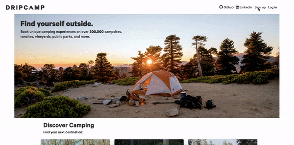

# Dripcamp

[Live Site](https://dripcamp.herokuapp.com)

Dripcamp is a full-stack clone of hipcamp.com, a campground booking website similar to AirBnB. 

## Technologies
- PostgreSQL
- Ruby on Rails
- React.js
- Redux.js
- Node.js
- Google Maps API
- Webpack
- Amazon AWS S3

Dripcamp was built with the Ruby on Rails backend framework. All of the data was stored through the PostgreSQL database, with large photos for campgrounds being uploaded and stored through Amazon AWS and S3 storage. The frontend utilizes React and Redux to create a dynamic, single-page web app which allows users to smoothly navigate throughout the site and allows for dynamic updating (creating, deleting booking).

## Features
### User Auth
- Users can sign up and create an account for the Dripcamp, and can also log in to view their user profile
- Log in and sign up forms are rendered via animated modals, which were constructed using React.js components and CSS
- If a visitor does not want to create an account, they can log in as a demo user, giving them full access to all of Dripcamp's campground, booking, and review features

</img>

### Campgrounds
- Users can browse through a collection of listed campgrounds
- The campground show page displays images with an interactive, animated carousel built using Vanilla DOM and CSS
- Campgrounds show campsite area details, essentials, amenities, and activities which dynamically render different icons based on availability

</img>

### Bookings
- The booking form is rendered on the campground show page, giving users easy access to book a campground
- The date picker was implemented using the AirBnB react-dates libary, giving users a simple easy-to-use design for picking start and end dates for the trip
- A user can view their bookings on their user profile page (My Trips), where they can view their booking details and cancel bookings

### Reviews

### Google Maps
- The campground show page incorporates the Google Maps API, showing users its exact location
- The location marker was added using Google Maps Circles, using a campground's latitutde and longitude to render a marker at those coordinates